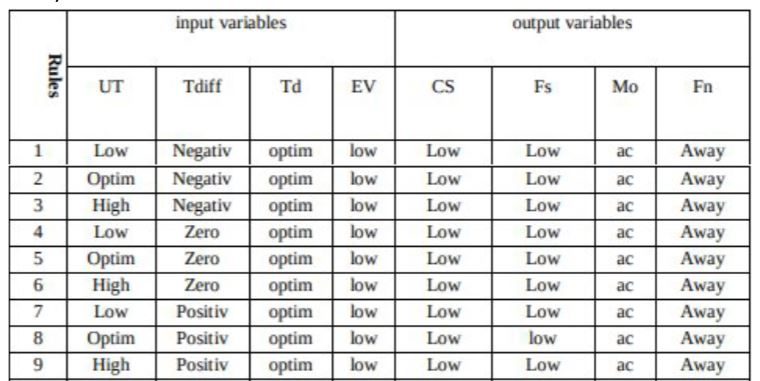

# **Task 3. Fuzzy Logic Inference**

- Nordin El Balima Cordero - Politechnika Wroclawska

## 1. Task Goal

The goal of the assignment is to introduce us the Fuzzy Logic Inference system basics.

## 2. Fuzzy Logic

We, as humans, are always making decisions based on the environment we see unlike machines, that are taught to do things based on a *true or false* statement. For that reason we introduce the **Fuzzy Logic**, this works on more complex systems that needs to take into account more variables and their probability.

## 3. Task

In this task we have to follow these rules:


The rules are presented in this format and we only have to put the range of each function.

After following all the rules, we get a graphic like this for inputs:


And for outputs:


Our input values for fuzzy membership functions:

We just need to put out values for UT, Tdiff, etc and the skicit library function helps us with the maths.

```{python}

UT, Tdiff, Td, EV = 28.5, 2.5, 16, 150

UT_level_low = fuzz.interp_membership(x_UT, UT_low, UT)
UT_level_opt = fuzz.interp_membership(x_UT, UT_opt, UT)
UT_level_high = fuzz.interp_membership(x_UT, UT_high, UT)

Tdiff_level_negative = fuzz.interp_membership(x_Tdiff, Tdiff_negative, Tdiff)
Tdiff_level_zero = fuzz.interp_membership(x_Tdiff, Tdiff_zero, Tdiff)
Tdiff_level_positive = fuzz.interp_membership(x_Tdiff, Tdiff_positive, Tdiff)
Tdiff_level_large = fuzz.interp_membership(x_Tdiff, Tdiff_large, Tdiff)

Td_level_optimal = fuzz.interp_membership(x_Td, Td_optimal, Td)
Td_level_humid = fuzz.interp_membership(x_Td, Td_humid, Td)

EV_level_low = fuzz.interp_membership(x_EV, EV_low, EV)
EV_level_regular = fuzz.interp_membership(x_EV, EV_regular, EV)

```

For applying our cases from the table:

```{python}

active_rules = []

for Td_level in (Td_level_optimal, Td_level_humid):
    for EV_level in (EV_level_low, EV_level_regular):
        for Tdiff_level in (Tdiff_level_negative, Tdiff_level_zero,
        Tdiff_level_positive, Tdiff_level_large):
            for UT_level in (UT_level_low, UT_level_opt, UT_level_high):
                active_rules.append(np.fmin(np.fmin(np.fmin(UT_level, Tdiff_level, , Td_level), EV_level))

```

Now we have to take into account the given table:



To do that so, we will loop and add all the elements to our full list with the numbers needed, then we use the fmin function again to cut the top of the corresponding functions.

```{python}

all_output_activation_rules = []
tmp = []
for i in range(len(active_rules)):
    if 1 <= i <= 18 or 25 <= i <= 36 or 38 <= i <= 39:
        tmp.append(active_rules[i])     # This needs to be done for every state
all_output_activation_rules.append(tmp) # of every output


activations = []
for output_activation_rules in all_output_activation_rules:
    tmp = output_activation_rules[0]
    for activation in output_activation_rules:
        tmp = np.fmax(tmp, activation)
    activations.append(np.fmin(tmp, output_membership_functions[len(activations)]))


```

After that, we need to do the duzzification, for that we use *aggregated* to put all our cases together and then we use *defuzz* function to calculate the result using the centroid method:

```{python}

aggregated_CS = np.fmax(np.fmax(activations[0], activations[1]), activations[2])
aggregated_FS = np.fmax(np.fmax(activations[3], activations[4]), activations[5])
aggregated_MO = np.fmax(activations[6], activations[7])
aggregated_FN = np.fmax(activations[8], activations[9])

CS = fuzz.defuzz(x_SC, aggregated_CS, 'centroid')
FS = fuzz.defuzz(x_FC, aggregated_FS, 'centroid')
MO = fuzz.defuzz(x_Mo, aggregated_MO, 'centroid')
FN = fuzz.defuzz(x_Fn, aggregated_FN, 'centroid')

```

